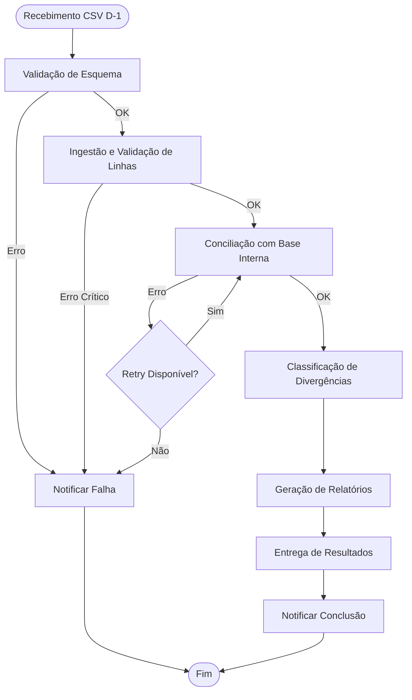
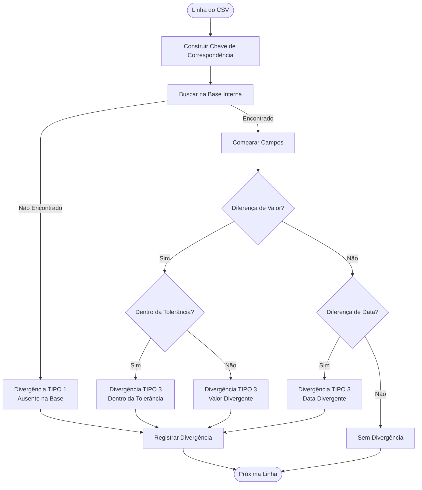
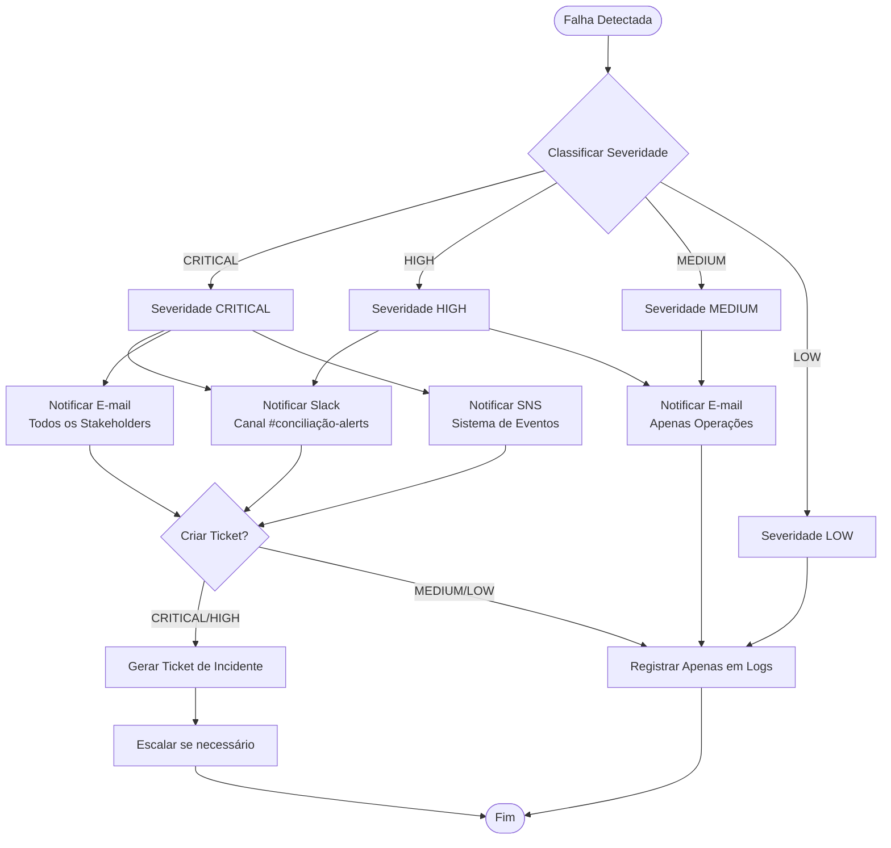

# PRD - Sistema de Conciliação Financeira

**Versão:** 1.0  
**Data:** 16 de Fevereiro de 2026  
**Status:** Em Validação  
**Autor:** Agente de Negócio

---

## 1. Visão Geral e Contexto

### 1.1 Problema
A empresa recebe diariamente (D-1) um arquivo CSV do fornecedor contendo transações financeiras com aproximadamente **1 milhão de linhas por dia**. A empresa já possui uma base interna com os mesmos campos. É necessário um **sistema de conciliação** que identifique divergências entre as duas bases em até **20 minutos**, notifique falhas e entregue um pacote de divergências consumível pela área de negócio.

### 1.2 Objetivo
Produzir um sistema automatizado de conciliação que:
- Processe 1 milhão de transações em até 20 minutos
- Identifique e categorize todas as divergências entre CSV do fornecedor e base interna
- Notifique falhas de processamento em tempo real
- Entregue resultados estruturados e acionáveis para a área de negócio

### 1.3 Escopo
- **Incluído**: Ingestão de CSV, validação de dados, conciliação, geração de relatórios de divergência, notificações
- **Excluído**: Correção automática de divergências, interface de usuário para visualização manual, integração com sistemas externos além do fornecedor

---

## 2. Dados de Entrada

### 2.1 Formato do CSV

**Campos obrigatórios** (separados por ponto-e-vírgula):
- `fornecedor_id`: Identificador único do fornecedor (string, obrigatório)
- `ordem_id`: Identificador único da ordem/transação (string, obrigatório)
- `nome`: Nome do cliente/beneficiário (string, obrigatório)
- `ativo_id`: Identificador do ativo financeiro (string, obrigatório)
- `data`: Data da transação no formato YYYY-MM-DD (date, obrigatório)
- `valor`: Valor monetário da transação (decimal com 2 casas decimais, obrigatório)

**Exemplo de linha válida:**
```
12345;ORD-98765;João Silva;ATV-001;2026-02-15;1500.75
```

**Exemplo de CSV completo:**
```csv
fornecedor_id;ordem_id;nome;ativo_id;data;valor
12345;ORD-98765;João Silva;ATV-001;2026-02-15;1500.75
12345;ORD-98766;Maria Santos;ATV-002;2026-02-15;2300.50
12346;ORD-98767;Pedro Costa;ATV-001;2026-02-15;890.25
```

### 2.2 Validações Iniciais

#### 2.2.1 Validação de Esquema
- **Critério de Aceitação**: O sistema deve validar que todos os campos obrigatórios estão presentes no cabeçalho
- **Ação em caso de falha**: Rejeitar arquivo e notificar erro de esquema

#### 2.2.2 Validação de Tipos
- `fornecedor_id`: String não vazia, máximo 50 caracteres
- `ordem_id`: String não vazia, máximo 100 caracteres, formato esperado: `ORD-XXXXX`
- `nome`: String não vazia, máximo 200 caracteres
- `ativo_id`: String não vazia, máximo 50 caracteres
- `data`: Formato YYYY-MM-DD, data válida (não futura além de D+1)
- `valor`: Decimal positivo, máximo 2 casas decimais, valor > 0

#### 2.2.3 Validação de Valores Nulos
- **Critério de Aceitação**: Nenhum campo obrigatório pode estar vazio ou nulo
- **Ação**: Linha deve ser marcada como inválida e incluída no relatório de erros

#### 2.2.4 Validação de Duplicatas
- **Critério de Aceitação**: Identificar linhas duplicadas dentro do mesmo arquivo CSV
- **Regra**: Duas linhas são consideradas duplicadas se todos os campos forem idênticos
- **Ação**: Primeira ocorrência mantida, demais marcadas como duplicatas no relatório

### 2.3 Volume Esperado
- **Volume diário**: 1.000.000 de linhas por execução (D-1)
- **Pico estimado**: Até 1.500.000 linhas em dias de maior volume
- **Frequência**: Uma execução por dia, após recebimento do arquivo do fornecedor

---

## 3. Regras de Conciliação

### 3.1 Chave de Correspondência

**Chave de Correspondência Definitiva**: Será utilizada apenas a `ordem_id` como chave única para as transações.

**Justificativa**: O campo `ordem_id` já garante unicidade no contexto da conciliação, não sendo necessário combinar outros campos.

**Critério de Aceitação**: Todas as validações e regras de conciliação devem ter como base a unicidade do campo `ordem_id`.


### 3.2 Tipos de Divergência

#### 3.2.1 Tipo 1: Presente no CSV, Ausente na Base da Empresa
- **Descrição**: Transação existe no CSV do fornecedor mas não foi encontrada na base interna da empresa
- **Exemplo**: 
  - CSV: `12345;ORD-98765;João Silva;ATV-001;2026-02-15;1500.75`
  - Base: Não encontrada
- **Ação recomendada**: Investigar se transação foi perdida no processo interno ou se é uma transação nova não registrada

#### 3.2.2 Tipo 2: Presente na Base da Empresa, Ausente no CSV
- **Descrição**: Transação existe na base interna mas não está presente no CSV do fornecedor
- **Exemplo**:
  - Base: `12345;ORD-98765;João Silva;ATV-001;2026-02-15;1500.75`
  - CSV: Não encontrada
- **Ação recomendada**: Verificar se transação foi cancelada, revertida ou se há atraso no envio do fornecedor

#### 3.2.3 Tipo 3: Presente em Ambos, mas com Campos Divergentes
- **Descrição**: Transação existe em ambas as bases, mas há diferenças em campos críticos
- **Campos críticos para comparação**:
  - `valor`: Diferença numérica no valor da transação
  - `data`: Diferença na data da transação
  - `nome`: Diferença no nome do beneficiário (opcional, dependendo de regra de negócio)
- **Exemplo de divergência de valor**:
  - CSV: `12345;ORD-98765;João Silva;ATV-001;2026-02-15;1500.75`
  - Base: `12345;ORD-98765;João Silva;ATV-001;2026-02-15;1500.00`
  - Diferença: R$ 0,75
- **Ação recomendada**: Verificar se diferença está dentro da tolerância aceitável ou se requer correção manual

### 3.3 Política de Tolerância

#### 3.3.1 Tolerância Numérica
- **Critério**: Diferenças de valor ≤ R$ 0,01 (um centavo) são consideradas aceitáveis devido a arredondamentos
- **Regra de arredondamento**: Valores devem ser comparados com precisão de 2 casas decimais
- **Ação**: Divergências dentro da tolerância são marcadas como "Dentro da Tolerância" mas ainda reportadas para auditoria

#### 3.3.2 Tolerância de Data
- **Critério**: Diferenças de até 1 dia são consideradas aceitáveis devido a processamento em diferentes fusos horários
- **Regra**: Comparação deve considerar data no fuso horário UTC
- **Ação**: Divergências de data dentro da tolerância são marcadas como "Ajuste de Fuso Horário"

#### 3.3.3 Regras de Arredondamento
- Valores devem ser arredondados para 2 casas decimais antes da comparação
- Método de arredondamento: Round half to even (banker's rounding)

**Critério de Aceitação**: Políticas de tolerância devem ser aprovadas pela área de negócio e área financeira.

---

## 4. Processamento e Performance

### 4.1 Tempo Máximo de Processamento

**SLA Crítico**: 20 minutos do início da ingestão até a entrega do resultado consolidado

**Breakdown sugerido**:
- Ingestão e validação: ≤ 3 minutos
- Conciliação: ≤ 15 minutos
- Geração de relatórios: ≤ 2 minutos
- **Total**: ≤ 20 minutos

**Critério de Aceitação**: Sistema deve processar 1M de linhas em ≤ 20 minutos em ambiente de produção, com 95% de confiança.

### 4.2 Requisitos de Escalabilidade

#### 4.2.1 Paralelismo
- Processamento paralelo por partição (fornecedor_id, data)
- Mínimo de 10 workers paralelos para processamento de conciliação
- Processamento distribuído recomendado (ex: Spark, Dask, ou similar)

#### 4.2.2 Particionamento
- Particionar dados por:
  1. `fornecedor_id` (primeiro nível)
  2. `data` (segundo nível)
  3. Hash de `ordem_id` (terceiro nível, para balanceamento)

#### 4.2.3 Picos de Volume
- Sistema deve suportar até 1.5M linhas (50% acima do volume normal)
- Auto-scaling baseado em métricas de CPU e memória
- Queue de processamento para gerenciar picos

### 4.3 Critérios de Retry e Falha

#### 4.3.1 Quando Reprocessar
- Falha na validação de esquema: Não reprocessar automaticamente (requer correção manual)
- Falha de conectividade com base interna: Retry automático
- Timeout de processamento: Retry automático
- Erro de memória/recursos: Escalar recursos e retry

#### 4.3.2 Estratégia de Backoff
- Retry exponencial com backoff: 1min, 2min, 4min, 8min
- Máximo de 3 tentativas automáticas
- Após 3 tentativas, escalar para equipe de operações

#### 4.3.3 Limites de Falha
- Taxa de erro > 5%: Parar processamento e notificar imediatamente
- Tempo de processamento > 25 minutos: Abortar e notificar
- Falha crítica de infraestrutura: Escalar imediatamente

**Critério de Aceitação**: Sistema deve ter retry automático para falhas transitórias e notificação imediata para falhas críticas.

---

## 5. Notificações e Entrega das Divergências

### 5.1 Notificação de Falha

#### 5.1.1 Destinatários
- **Equipe de Operações/SRE**: Notificação imediata via Slack e e-mail
- **Product Owner**: Notificação via e-mail para falhas críticas
- **Área de Negócio**: Notificação via e-mail para falhas que impedem entrega de resultados

#### 5.1.2 Canais de Notificação
- **Slack**: Canal #conciliação-alerts (notificações em tempo real)
- **E-mail**: Lista de distribuição conciliacao-alerts@empresa.com
- **SNS (AWS)**: Tópico para integração com outros sistemas

#### 5.1.3 Conteúdo Mínimo da Notificação
Cada notificação deve conter:
- `job_id`: Identificador único da execução
- `timestamp`: Data e hora da falha (UTC)
- `motivo`: Descrição clara do erro
- `amostra`: 5 linhas com erro (se aplicável)
- `link_para_logs`: URL para logs detalhados
- `severidade`: CRITICAL, HIGH, MEDIUM, LOW
- `acao_requerida`: Descrição da ação necessária

**Template de Notificação de Falha:**
```
🚨 FALHA NO PROCESSAMENTO DE CONCILIAÇÃO

Job ID: JOB-20260216-001234
Timestamp: 2026-02-16 08:15:30 UTC
Severidade: CRITICAL

Motivo: Erro de validação de esquema - Campo 'valor' ausente no CSV

Amostra de linhas com erro:
Linha 150: 12345;ORD-98765;João Silva;ATV-001;2026-02-15;
Linha 151: 12345;ORD-98766;Maria Santos;ATV-002;2026-02-15;
...

Link para logs: https://logs.empresa.com/jobs/JOB-20260216-001234

Ação Requerida: Verificar formato do CSV com fornecedor e reprocessar após correção.
```

### 5.2 Entrega de Resultados

#### 5.2.1 Formatos de Entrega

**1. CSV com Marcação de Tipo de Divergência**
- Formato: CSV com colunas adicionais `tipo_divergencia` e `detalhes`
- Localização: Bucket S3 ou storage compartilhado
- Nome do arquivo: `divergencias_YYYY-MM-DD_HHMMSS.csv`

**Exemplo de CSV de saída:**
```csv
fornecedor_id;ordem_id;nome;ativo_id;data;valor_csv;valor_base;tipo_divergencia;detalhes;severidade
12345;ORD-98765;João Silva;ATV-001;2026-02-15;1500.75;1500.00;TIPO_3_VALOR;Diferença de R$ 0,75;MEDIUM
12346;ORD-98766;Maria Santos;ATV-002;2026-02-15;2300.50;;TIPO_1_AUSENTE_BASE;Transação não encontrada na base interna;HIGH
12347;ORD-98767;Pedro Costa;ATV-001;2026-02-15;;890.25;TIPO_2_AUSENTE_CSV;Transação não encontrada no CSV;HIGH
```

**2. Dashboard (Opcional - Fase 2)**
- Visualização de métricas de conciliação
- Gráficos de divergências por tipo
- Filtros por fornecedor, data, severidade

**3. API REST**
- Endpoint: `GET /api/v1/reconciliations/{job_id}/divergences`
- Formato de resposta: JSON
- Paginação: 1000 registros por página

**Payload mínimo por divergência (JSON):**
```json
{
  "divergence_id": "DIV-20260216-001",
  "job_id": "JOB-20260216-001234",
  "tipo_divergencia": "TIPO_3_VALOR",
  "chave": {
    "fornecedor_id": "12345",
    "ordem_id": "ORD-98765",
    "ativo_id": "ATV-001",
    "data": "2026-02-15"
  },
  "dados_csv": {
    "nome": "João Silva",
    "valor": 1500.75
  },
  "dados_base": {
    "nome": "João Silva",
    "valor": 1500.00
  },
  "detalhes": "Diferença de R$ 0,75",
  "severidade": "MEDIUM",
  "timestamp": "2026-02-16T08:15:30Z"
}
```

#### 5.2.2 Prioritização de Divergências

**Ordem de prioridade**:
1. **TIPO_2_AUSENTE_CSV** (Alta prioridade - pode indicar problema no fornecedor)
2. **TIPO_1_AUSENTE_BASE** (Alta prioridade - pode indicar perda de dados)
3. **TIPO_3_VALOR** com diferença > R$ 100,00 (Alta prioridade)
4. **TIPO_3_VALOR** com diferença entre R$ 0,01 e R$ 100,00 (Média prioridade)
5. **TIPO_3_VALOR** dentro da tolerância (Baixa prioridade - apenas auditoria)
6. **TIPO_3_DATA** (Média prioridade)

**Critério de Aceitação**: Sistema deve entregar resultados ordenados por prioridade e agrupados por tipo de divergência.

---

## 6. Observabilidade e Auditoria

### 6.1 Logs de Ingestão

**Informações a serem logadas**:
- Timestamp de início e fim da ingestão
- Número total de linhas processadas
- Número de linhas válidas vs inválidas
- Tempo de processamento por etapa
- Hash do arquivo CSV processado (SHA-256)

**Formato de log estruturado (JSON):**
```json
{
  "timestamp": "2026-02-16T08:00:00Z",
  "level": "INFO",
  "job_id": "JOB-20260216-001234",
  "event": "ingestion_completed",
  "metrics": {
    "total_lines": 1000000,
    "valid_lines": 999500,
    "invalid_lines": 500,
    "processing_time_seconds": 180
  },
  "file_hash": "a1b2c3d4e5f6..."
}
```

### 6.2 Métricas de Latência

**Métricas a serem coletadas**:
- Tempo de ingestão (P50, P95, P99)
- Tempo de conciliação (P50, P95, P99)
- Tempo total de processamento (P50, P95, P99)
- Taxa de throughput (linhas/segundo)

**Dashboard de métricas**:
- Grafana ou similar para visualização em tempo real
- Alertas configurados para latência P95 > 18 minutos

### 6.3 Contadores de Divergência por Tipo

**Métricas a serem coletadas**:
- Total de divergências por tipo (TIPO_1, TIPO_2, TIPO_3_VALOR, TIPO_3_DATA)
- Taxa de divergência (% do total de transações)
- Tendência histórica (comparação com dias anteriores)

**Alertas**:
- Taxa de divergência > 5%: Alerta médio
- Taxa de divergência > 10%: Alerta crítico

### 6.4 Rastreabilidade de Linha

**Hash de linha**:
- Cada linha processada deve ter um hash único (SHA-256) baseado em todos os campos
- Hash deve ser incluído nos logs e no relatório de divergências
- Permite rastreabilidade completa para auditoria

**Exemplo**:
- Linha: `12345;ORD-98765;João Silva;ATV-001;2026-02-15;1500.75`
- Hash: `sha256("12345|ORD-98765|João Silva|ATV-001|2026-02-15|1500.75")`

### 6.5 Retenção de Dados para Auditoria

**Período de retenção**:
- Logs detalhados: 90 dias
- Relatórios de divergência: 2 anos
- Dados de conciliação (snapshot): 1 ano
- Métricas agregadas: 5 anos

**Critério de Aceitação**: Sistema deve manter rastreabilidade completa de todas as transações processadas por período mínimo de 2 anos.

---

## 7. Segurança e Compliance

### 7.1 Criptografia

#### 7.1.1 Criptografia em Trânsito
- **Protocolo**: TLS 1.3 para todas as comunicações
- **Certificados**: Certificados válidos e renovados automaticamente
- **Validação**: Validação de certificados em todas as conexões

#### 7.1.2 Criptografia em Repouso
- **Algoritmo**: AES-256 para dados armazenados
- **Gerenciamento de chaves**: AWS KMS ou equivalente
- **Rotação**: Rotação automática de chaves a cada 90 dias

### 7.2 Controle de Acesso

**Modelo de acesso**:
- **Princípio do menor privilégio**: Usuários têm acesso apenas ao necessário
- **Autenticação**: SSO (Single Sign-On) obrigatório
- **Autorização**: RBAC (Role-Based Access Control)

**Roles definidas**:
- `reconciliation-admin`: Acesso completo ao sistema
- `reconciliation-operator`: Acesso para monitoramento e operação
- `reconciliation-viewer`: Acesso apenas leitura para relatórios
- `reconciliation-bot`: Acesso para integrações automatizadas

### 7.3 Mascaramento de Dados Sensíveis

**Campos a serem mascarados em logs e relatórios**:
- `nome`: Mascarar para `***Silva` (mostrar apenas último nome)
- `valor`: Manter valor completo (necessário para conciliação)
- `fornecedor_id`, `ordem_id`, `ativo_id`: Manter completo (necessário para rastreabilidade)

**Critério de Aceitação**: Dados sensíveis devem ser mascarados em todos os logs e relatórios, exceto quando necessário para operação.

### 7.4 Requisitos Regulatórios

**Pergunta Aberta**: Requisitos legais específicos de retenção e mascaramento precisam ser confirmados com área jurídica/compliance.

**Requisitos sugeridos a validar**:
- LGPD (Lei Geral de Proteção de Dados): Consentimento e direito ao esquecimento
- Normas do Banco Central: Retenção de dados financeiros
- SOX (se aplicável): Auditoria e rastreabilidade

**Critério de Aceitação**: Sistema deve estar em conformidade com todas as regulamentações aplicáveis, validado pela área de compliance.

---

## 8. Operação e Escalonamento

### 8.1 Runbook para Falhas

#### 8.1.1 Falha na Ingestão

**Sintomas**:
- Job falha nos primeiros 3 minutos
- Erro de validação de esquema ou formato

**Ações**:
1. Verificar logs do job_id específico
2. Validar formato do CSV recebido do fornecedor
3. Se erro de formato: Contatar fornecedor para correção
4. Se erro interno: Verificar conectividade e recursos
5. Após correção: Reprocessar manualmente

**Tempo de resposta**: ≤ 15 minutos

#### 8.1.2 Falha na Conciliação

**Sintomas**:
- Job falha após ingestão bem-sucedida
- Timeout ou erro de memória durante conciliação

**Ações**:
1. Verificar métricas de recursos (CPU, memória)
2. Se timeout: Aumentar recursos ou otimizar query
3. Se erro de memória: Particionar processamento em lotes menores
4. Verificar conectividade com base interna
5. Reprocessar após correção

**Tempo de resposta**: ≤ 30 minutos

#### 8.1.3 Falha na Entrega de Resultados

**Sintomas**:
- Processamento completo mas resultados não disponíveis
- Erro ao escrever arquivo de saída

**Ações**:
1. Verificar permissões de escrita no storage
2. Verificar espaço em disco disponível
3. Verificar conectividade com storage
4. Regenerar resultados se necessário

**Tempo de resposta**: ≤ 10 minutos

### 8.2 Responsáveis e SLA de Resposta

| Severidade | Tempo de Resposta | Responsável | Escalation |
|------------|-------------------|-------------|------------|
| CRITICAL | ≤ 15 minutos | Equipe de Operações | Product Owner + Engenharia |
| HIGH | ≤ 1 hora | Equipe de Operações | Engenharia |
| MEDIUM | ≤ 4 horas | Equipe de Operações | - |
| LOW | ≤ 1 dia útil | Equipe de Operações | - |

### 8.3 Contatos de Emergência

**Pergunta Aberta**: Lista completa de contatos precisa ser definida.

**Contatos sugeridos**:
- **Equipe de Operações/SRE**: ops-conciliacao@empresa.com, Slack #ops-oncall
- **Product Owner**: po-conciliacao@empresa.com
- **Engenharia**: eng-conciliacao@empresa.com
- **Área de Negócio**: negocio-conciliacao@empresa.com
- **Fornecedor**: [contato a ser definido]

**Critério de Aceitação**: Runbook completo e atualizado, com contatos validados e testados em exercício de simulação.

---

## 9. Entregáveis do PRD

### 9.1 Documento PRD
- ✅ Este documento em formato Markdown
- 📄 Versão PDF para distribuição (gerar a partir do Markdown)
- 📊 Diagramas de fluxo incluídos

### 9.2 Exemplos de CSV

**CSV de entrada válido** (exemplo completo):
```csv
fornecedor_id;ordem_id;nome;ativo_id;data;valor
12345;ORD-98765;João Silva;ATV-001;2026-02-15;1500.75
12345;ORD-98766;Maria Santos;ATV-002;2026-02-15;2300.50
12346;ORD-98767;Pedro Costa;ATV-001;2026-02-15;890.25
12346;ORD-98768;Ana Oliveira;ATV-003;2026-02-15;1750.00
```

**CSV de saída com divergências marcadas**:
```csv
fornecedor_id;ordem_id;nome;ativo_id;data;valor_csv;valor_base;tipo_divergencia;detalhes;severidade;hash_linha
12345;ORD-98765;João Silva;ATV-001;2026-02-15;1500.75;1500.00;TIPO_3_VALOR;Diferença de R$ 0,75;MEDIUM;a1b2c3d4e5f6...
12345;ORD-98766;Maria Santos;ATV-002;2026-02-15;2300.50;;TIPO_1_AUSENTE_BASE;Transação não encontrada na base interna;HIGH;b2c3d4e5f6a1...
12347;ORD-98769;Carlos Mendes;ATV-001;2026-02-15;;890.25;TIPO_2_AUSENTE_CSV;Transação não encontrada no CSV;HIGH;c3d4e5f6a1b2...
```

### 9.3 Lista de APIs/Events para Integração

#### 9.3.1 API REST

**Endpoint: Obter Divergências**
```
GET /api/v1/reconciliations/{job_id}/divergences
Query Parameters:
  - tipo_divergencia (opcional): TIPO_1, TIPO_2, TIPO_3_VALOR, TIPO_3_DATA
  - severidade (opcional): HIGH, MEDIUM, LOW
  - page (opcional): número da página (default: 1)
  - page_size (opcional): tamanho da página (default: 1000, max: 10000)
Response: JSON com lista de divergências paginada
```

**Endpoint: Status do Job**
```
GET /api/v1/reconciliations/{job_id}/status
Response: JSON com status, métricas e progresso
```

**Endpoint: Reprocessar**
```
POST /api/v1/reconciliations/{job_id}/reprocess
Body: JSON com parâmetros opcionais de reprocessamento
Response: JSON com novo job_id
```

#### 9.3.2 Eventos (Event-Driven)

**Evento: Conciliação Concluída**
```json
{
  "event_type": "reconciliation.completed",
  "job_id": "JOB-20260216-001234",
  "timestamp": "2026-02-16T08:20:00Z",
  "metrics": {
    "total_transactions": 1000000,
    "total_divergences": 1500,
    "processing_time_seconds": 1200
  },
  "result_location": "s3://bucket/divergencias_2026-02-16_082000.csv"
}
```

**Evento: Conciliação Falhou**
```json
{
  "event_type": "reconciliation.failed",
  "job_id": "JOB-20260216-001234",
  "timestamp": "2026-02-16T08:15:30Z",
  "error": {
    "code": "VALIDATION_ERROR",
    "message": "Campo 'valor' ausente no CSV",
    "severity": "CRITICAL"
  }
}
```

### 9.4 Matriz de Riscos e Mitigação

| Risco | Probabilidade | Impacto | Severidade | Mitigação |
|-------|---------------|---------|------------|-----------|
| CSV com formato incorreto | Média | Alto | ALTA | Validação rigorosa de esquema, notificação imediata ao fornecedor |
| Volume maior que 1.5M linhas | Baixa | Alto | MÉDIA | Auto-scaling, alertas proativos, capacidade até 2M linhas |
| Falha na base interna | Baixa | Crítico | ALTA | Retry automático, fallback para cache, notificação imediata |
| Processamento > 20 minutos | Média | Alto | ALTA | Otimização de queries, paralelismo, monitoramento de performance |
| Perda de dados de auditoria | Baixa | Crítico | ALTA | Backup automático, replicação, retenção garantida |
| Divergências não detectadas | Média | Alto | ALTA | Testes abrangentes, validação cruzada, revisão de regras |
| Ataque de segurança | Baixa | Crítico | ALTA | Criptografia, controle de acesso, auditoria de segurança |
| Falha de notificação | Baixa | Médio | MÉDIA | Múltiplos canais, retry de notificação, fallback |

---

## 10. Critérios de Aceitação

### 10.1 Aprovação de Stakeholders
- ✅ **Product Owner**: Aprovação do PRD e priorização de requisitos
- ✅ **Time de Operações**: Validação de runbooks e SLAs
- ✅ **Área de Negócio**: Validação de regras de conciliação e formatos de entrega
- ✅ **Equipe de Engenharia**: Validação de viabilidade técnica e estimativas

### 10.2 Teste de Performance

**Cenário de teste**:
- Dataset: 1.000.000 de linhas simuladas
- Ambiente: Ambiente de produção ou equivalente
- Critério: Processamento completo em ≤ 20 minutos

**Plano de teste de carga**:
1. Preparar dataset de teste com 1M linhas válidas
2. Executar processamento completo
3. Medir tempo de cada etapa (ingestão, conciliação, geração de relatórios)
4. Validar que tempo total ≤ 20 minutos
5. Executar 5 vezes e calcular média, P95 e P99
6. Validar que P95 ≤ 20 minutos

**Critério de Aceitação**: Sistema deve processar 1M linhas em ≤ 20 minutos com 95% de confiança (P95 ≤ 20min).

### 10.3 Definição de Notificações

**Critério de Aceitação**: 
- Templates de notificação aprovados por todos os stakeholders
- Canais de notificação configurados e testados
- Lista de destinatários validada
- Teste de notificação bem-sucedido em todos os canais

---

## 11. Stakeholders e Responsabilidades

| Stakeholder | Papel | Responsabilidades |
|-------------|-------|-------------------|
| **Product Owner** | Aprovar PRD e priorizar requisitos | - Aprovar PRD final<br>- Priorizar features<br>- Validar entregas<br>- Gerenciar backlog |
| **Área de Conciliação / Negócio** | Consumir divergências; validar regras de negócio | - Validar regras de conciliação<br>- Consumir relatórios de divergência<br>- Definir ações para cada tipo de divergência<br>- Validar políticas de tolerância |
| **Equipe de Dados / Engenharia** | Implementar pipeline e infra | - Desenvolver sistema de conciliação<br>- Implementar pipeline de dados<br>- Configurar infraestrutura<br>- Otimizar performance |
| **Fornecedor** | Garantir formato e qualidade do CSV | - Enviar CSV no formato correto<br>- Garantir qualidade dos dados<br>- Corrigir problemas identificados |
| **Operações / SRE** | Monitoramento e runbooks | - Monitorar execuções<br>- Responder a incidentes<br>- Manter runbooks atualizados<br>- Gerenciar escalonamento |

---

## 12. Testes e Validação

### 12.1 Testes de Aceitação

#### 12.1.1 Teste de Ingestão
- **Dado**: CSV válido com 1M linhas
- **Quando**: Sistema processa o arquivo
- **Então**: 
  - Todas as linhas são validadas
  - Linhas inválidas são identificadas e reportadas
  - Processamento completa em ≤ 3 minutos

#### 12.1.2 Teste de Conciliação - Tipo 1
- **Dado**: Transação presente no CSV mas ausente na base
- **Quando**: Sistema executa conciliação
- **Então**: 
  - Divergência tipo 1 é identificada
  - Relatório contém detalhes completos
  - Severidade marcada como HIGH

#### 12.1.3 Teste de Conciliação - Tipo 2
- **Dado**: Transação presente na base mas ausente no CSV
- **Quando**: Sistema executa conciliação
- **Então**: 
  - Divergência tipo 2 é identificada
  - Relatório contém detalhes completos
  - Severidade marcada como HIGH

#### 12.1.4 Teste de Conciliação - Tipo 3 (Valor)
- **Dado**: Transação presente em ambas as bases com valor divergente
- **Quando**: Sistema executa conciliação
- **Então**: 
  - Divergência tipo 3 é identificada
  - Diferença de valor é calculada corretamente
  - Severidade é definida baseada na diferença

#### 12.1.5 Teste de Tolerância
- **Dado**: Diferença de valor ≤ R$ 0,01
- **Quando**: Sistema executa conciliação
- **Então**: 
  - Divergência é marcada como "Dentro da Tolerância"
  - Ainda aparece no relatório para auditoria
  - Severidade marcada como LOW

#### 12.1.6 Teste de Notificação de Falha
- **Dado**: Erro crítico durante processamento
- **Quando**: Sistema detecta falha
- **Então**: 
  - Notificação é enviada em ≤ 1 minuto
  - Todos os canais configurados recebem notificação
  - Template contém todas as informações necessárias

#### 12.1.7 Teste de Entrega de Resultados
- **Dado**: Processamento completo com divergências identificadas
- **Quando**: Sistema gera relatório
- **Então**: 
  - CSV de saída é gerado corretamente
  - Todas as divergências estão presentes
  - Formato está conforme especificação
  - API retorna dados corretamente

### 12.2 Plano de Validação de Performance

**Fase 1: Teste Unitário de Componentes**
- Testar validação de linha individual: < 1ms por linha
- Testar hash de linha: < 0.5ms por linha
- Testar comparação de valores: < 0.1ms por comparação

**Fase 2: Teste de Integração**
- Testar ingestão de 10K linhas: ≤ 10 segundos
- Testar conciliação de 10K linhas: ≤ 30 segundos
- Testar geração de relatório de 1K divergências: ≤ 5 segundos

**Fase 3: Teste de Carga**
- Testar ingestão de 100K linhas: ≤ 1 minuto
- Testar conciliação de 100K linhas: ≤ 3 minutos
- Testar processamento completo de 100K linhas: ≤ 5 minutos

**Fase 4: Teste de Produção**
- Testar processamento completo de 1M linhas: ≤ 20 minutos
- Executar 5 vezes e validar P95 ≤ 20 minutos
- Validar que sistema suporta até 1.5M linhas

**Critério de Aceitação**: Todas as fases de teste devem passar antes do deploy em produção.

---

## 13. Diagramas de Fluxo

### 13.1 Fluxo Geral de Processamento



### 13.2 Fluxo de Conciliação Detalhado



### 13.3 Fluxo de Notificação de Falha



---

## 14. Perguntas Abertas e Dependências

### 14.1 Perguntas Críticas que Precisam ser Respondidas

#### 14.1.1 Chave de Correspondência
- **Pergunta**: Qual é a combinação definitiva de campos que forma a chave única para correspondência?
- **Opções propostas**: 
  1. `fornecedor_id + ordem_id + ativo_id + data`
  2. `fornecedor_id + ordem_id + data`
  3. Outra combinação?
- **Responsável**: Área de Negócio / Product Owner
- **Prazo sugerido**: Antes do início do desenvolvimento
- **Impacto**: Alto - afeta toda a lógica de conciliação

#### 14.1.2 Regras de Negócio para Duplicatas
- **Pergunta**: Como tratar ordens duplicadas ou reversões de transações?
- **Cenários a considerar**:
  - Ordem aparece duas vezes no CSV com mesmo valor
  - Ordem aparece no CSV mas foi revertida na base interna
  - Ordem foi cancelada mas ainda aparece no CSV
- **Responsável**: Área de Negócio
- **Prazo sugerido**: Antes do início do desenvolvimento
- **Impacto**: Médio - afeta regras de conciliação

#### 14.1.3 Canais de Notificação Obrigatórios
- **Pergunta**: Quais canais de notificação são obrigatórios e quem são os contatos específicos?
- **Informações necessárias**:
  - Lista completa de e-mails para cada tipo de notificação
  - Configuração do canal Slack (webhook, canal)
  - Configuração do SNS (tópico, subscriptions)
  - Contatos de emergência 24/7
- **Responsável**: Operações / Product Owner
- **Prazo sugerido**: Antes do deploy em produção
- **Impacto**: Alto - necessário para operação

#### 14.1.4 Ambiente de Teste
- **Pergunta**: Existe um ambiente de teste com capacidade para processar 1M de linhas?
- **Informações necessárias**:
  - Ambiente disponível para testes de carga
  - Dataset de teste com 1M linhas realistas
  - Acesso à base interna de teste
- **Responsável**: Equipe de Engenharia / Infraestrutura
- **Prazo sugerido**: Antes dos testes de performance
- **Impacto**: Alto - necessário para validação

#### 14.1.5 Requisitos Legais de Retenção e Mascaramento
- **Pergunta**: Quais são os requisitos legais específicos de retenção de dados e mascaramento de dados sensíveis?
- **Informações necessárias**:
  - Período de retenção obrigatório por lei
  - Regulamentações aplicáveis (LGPD, Banco Central, etc.)
  - Regras específicas de mascaramento de dados pessoais
- **Responsável**: Área Jurídica / Compliance
- **Prazo sugerido**: Antes do design final de armazenamento
- **Impacto**: Alto - necessário para compliance

### 14.2 Dependências Técnicas

#### 14.2.1 Acesso à Base Interna
- **Dependência**: Acesso de leitura à base interna da empresa
- **Requisitos**: 
  - Conexão segura (VPN ou rede privada)
  - Credenciais com permissão de leitura
  - Performance adequada para queries de conciliação
- **Responsável**: Equipe de Dados / DBA
- **Prazo sugerido**: Antes do desenvolvimento

#### 14.2.2 Infraestrutura de Processamento
- **Dependência**: Infraestrutura capaz de processar 1M linhas em 20 minutos
- **Requisitos**:
  - Recursos computacionais (CPU, memória)
  - Storage para arquivos temporários
  - Rede com baixa latência para acesso à base
- **Responsável**: Equipe de Infraestrutura
- **Prazo sugerido**: Antes dos testes de performance

#### 14.2.3 Integração com Sistemas de Notificação
- **Dependência**: Configuração de Slack, SNS, e-mail
- **Requisitos**:
  - Webhook do Slack configurado
  - Tópico SNS criado
  - Servidor de e-mail configurado
- **Responsável**: Equipe de Infraestrutura / DevOps
- **Prazo sugerido**: Antes do deploy em produção

### 14.3 Dependências Organizacionais

#### 14.3.1 Aprovação de Stakeholders
- **Dependência**: Aprovação formal do PRD
- **Requisitos**: Assinaturas de Product Owner, Operações, Negócio
- **Responsável**: Product Owner
- **Prazo sugerido**: Antes do início do desenvolvimento

#### 14.3.2 Definição de Processo Operacional
- **Dependência**: Processo definido para tratamento de divergências
- **Requisitos**: 
  - Fluxo de trabalho para área de negócio
  - SLA de resposta para cada tipo de divergência
  - Escalonamento e responsabilidades
- **Responsável**: Área de Negócio / Operações
- **Prazo sugerido**: Antes do deploy em produção

---

## 15. Plano de Próximas Ações

### 15.1 Fase 1: Validação e Aprovação (Semana 1-2)
1. **Revisar PRD com Stakeholders**
   - Apresentar PRD para Product Owner
   - Revisar com Área de Negócio
   - Validar com Equipe de Operações
   - **Responsável**: Product Owner
   - **Prazo**: 2 semanas

2. **Responder Perguntas Abertas**
   - Definir chave de correspondência
   - Validar regras de negócio
   - Confirmar canais de notificação
   - **Responsável**: Respectivos stakeholders
   - **Prazo**: 2 semanas

3. **Aprovar PRD Final**
   - Consolidar feedback
   - Atualizar PRD com respostas
   - Obter aprovação formal
   - **Responsável**: Product Owner
   - **Prazo**: Final da semana 2

### 15.2 Fase 2: Design Técnico (Semana 3-4)
1. **Design da Arquitetura**
   - Definir arquitetura técnica
   - Escolher tecnologias
   - Design de banco de dados
   - **Responsável**: Equipe de Engenharia
   - **Prazo**: 2 semanas

2. **Especificação de APIs**
   - Definir contratos de API
   - Especificar eventos
   - Documentar integrações
   - **Responsável**: Equipe de Engenharia
   - **Prazo**: 1 semana (paralelo)

3. **Plano de Testes Detalhado**
   - Detalhar casos de teste
   - Preparar datasets de teste
   - Configurar ambiente de teste
   - **Responsável**: Equipe de QA / Engenharia
   - **Prazo**: 1 semana (paralelo)

### 15.3 Fase 3: Desenvolvimento (Semana 5-12)
1. **Sprint 1-2: Ingestão e Validação**
   - Implementar ingestão de CSV
   - Implementar validações
   - Testes unitários
   - **Responsável**: Equipe de Engenharia
   - **Prazo**: 2 semanas

2. **Sprint 3-4: Conciliação**
   - Implementar lógica de conciliação
   - Implementar classificação de divergências
   - Otimizar performance
   - **Responsável**: Equipe de Engenharia
   - **Prazo**: 2 semanas

3. **Sprint 5-6: Relatórios e Notificações**
   - Implementar geração de relatórios
   - Implementar notificações
   - Implementar APIs
   - **Responsável**: Equipe de Engenharia
   - **Prazo**: 2 semanas

4. **Sprint 7-8: Observabilidade e Segurança**
   - Implementar logs e métricas
   - Implementar segurança
   - Implementar auditoria
   - **Responsável**: Equipe de Engenharia
   - **Prazo**: 2 semanas

### 15.4 Fase 4: Testes e Validação (Semana 13-14)
1. **Testes de Integração**
   - Executar testes de integração
   - Validar fluxos end-to-end
   - **Responsável**: Equipe de QA
   - **Prazo**: 1 semana

2. **Testes de Performance**
   - Executar testes de carga
   - Validar SLA de 20 minutos
   - Otimizar se necessário
   - **Responsável**: Equipe de Engenharia / QA
   - **Prazo**: 1 semana

### 15.5 Fase 5: Deploy e Operação (Semana 15+)
1. **Deploy em Produção**
   - Deploy gradual (canary)
   - Monitoramento intensivo
   - **Responsável**: Equipe de Engenharia / Operações
   - **Prazo**: 1 semana

2. **Operação e Melhorias**
   - Monitorar execuções diárias
   - Coletar feedback
   - Implementar melhorias
   - **Responsável**: Equipe de Operações / Engenharia
   - **Prazo**: Contínuo

---

## 16. Conclusão

Este PRD descreve um sistema completo de conciliação financeira capaz de processar 1 milhão de transações em até 20 minutos, identificar divergências entre o CSV do fornecedor e a base interna da empresa, e entregar resultados estruturados e acionáveis para a área de negócio.

O documento cobre todos os aspectos necessários para o desenvolvimento e operação do sistema, incluindo:
- Especificações técnicas detalhadas
- Regras de negócio e conciliação
- Requisitos de performance e escalabilidade
- Segurança e compliance
- Operação e escalonamento
- Testes e validação

**Próximos passos críticos**:
1. Validar e aprovar este PRD com todos os stakeholders
2. Responder às perguntas abertas listadas na seção 14
3. Iniciar o design técnico detalhado
4. Começar o desenvolvimento seguindo o plano de próximas ações

---

**Documento gerado em**: 16 de Fevereiro de 2026  
**Versão**: 1.0  
**Status**: Aguardando Aprovação
